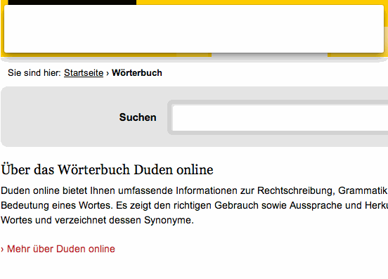

# Alfred Duden.de Search Workflow #

Search the definitive German dictionary at [Duden.de](http://www.duden.de/woerterbuch) with auto-suggest.

## Download and installation ##

Download the Workflow from the GitHub releases page or Packal. Double-click the `Duden-Search.alfredworkflow` file to install.

## Usage ##

Default keyword is `duden`. Enter your query after that.

Actioning a result with `RETURN` will open the full results page at duden.de in your browser.

## Licensing, thanks ##

The code of this workflow is released under the [MIT licence](http://opensource.org/licenses/MIT).

This workflow is based on the [Alfred-Workflow library](http://www.deanishe.net/alfred-workflow/index.html) (also MIT-licensed).
